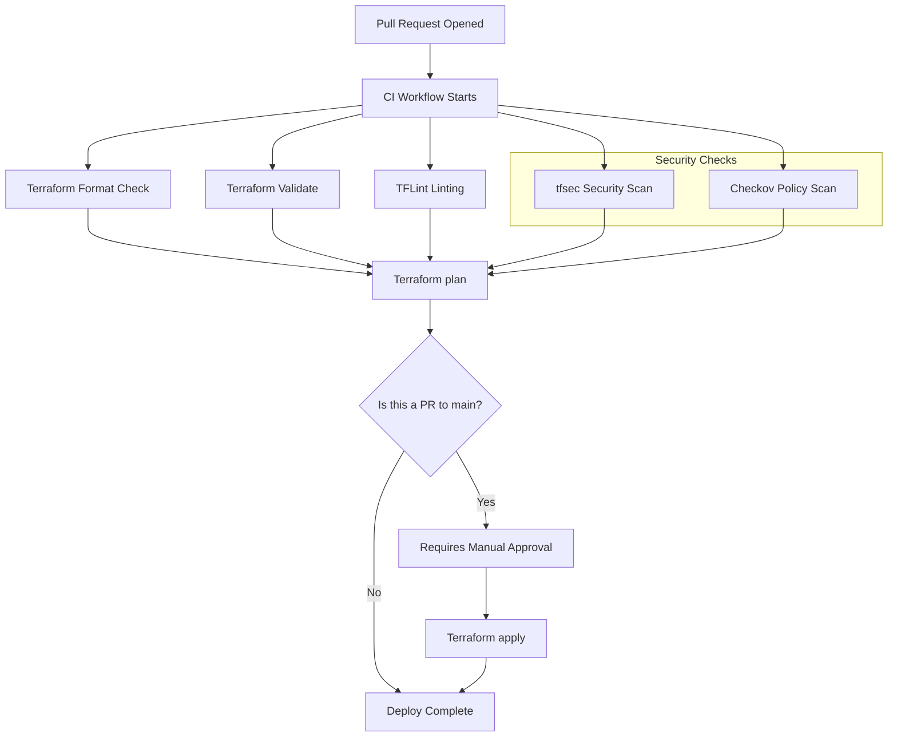

# Readme for mastercard technical assignment

## Mastercard technical assignment

The following assignment was given to me:
```
Please provide your solution in a presentation for the team where your skills and experience are best
displayed. Provide repository links, code and whatever means that we can use to assess your level of
skill.
Build an MVP pipeline to manage Infrastructure as Code components and use it to create and
manage a resource on AWS, fx. An EKS cluster.

a. Extra points: Use a complex resource that requires configurations and show how
you’d propagate those configurations through layers of environments (dev-test-
prod…)
b. More extrsa points: Include versioning on your pipeline
c. Even more extra points: Include Breaking change detection and testing of your
infrastructure components.
```

## Solution design

1. main terraform root module which will create an AWS EKS cluster in a defined vpc.
2. eks module in `modules/eks` -- creates the actual cluster.
   1. Future improvement: Move to it's own repo so it can be referenced with it's semver version. (see `.github/workflows/release.yml` for release pipeline)
3. All commands can be orchestrated through `Makefile` targets, which will automate the tedious tasks of setting up your shell environment for your local development purposes.
4. If using a Macbook, all necessary tools can be installed with `brew` with the `make install` command.
5. The CI/CD pipeline in `.github/workflows/ci.yml` runs the following process, when a PR is opened:



### Continuous Integration:
- Format
- Validate
- Lint
- tfsec
- checkov
- Terraform plan

If anyone of these are in breach of defined standards, the pipeline stops and the developer must find the introduced bug and remove it, before the terraform code can be applied into production.

### Continuous Delivery

6. If all gates have been passed the terraform code is ready for `terraform apply`, so if there's an approval on the PR it can go ahead and apply to production.
   1. Requires secrets for a valid AWS account and credentials loaded into the github repo.

Future improvements:
- Use [pre-commit](https://pre-commit.com/) for the ci steps, so bugs and formatting are caught on the developers machine.
- Create and use a [devcontainer](https://containers.dev/) for a unified developer experience.
- Use [terratest](https://terratest.gruntwork.io/) for testing the terraform code and the infrastructure that it will create.
- Use [terragrunt](https://terragrunt.gruntwork.io/) for DRY (Don't Repeat Yourself) tasks for the terraform code. This will also give some tools for better scaling.
- Setup SSO between the Github repo and AWS, so there's seamless integration and trust between an IAM role in AWS and then the pipeline assumes this role for full authentication and authorization.
- Use [AWS blueprints](https://github.com/aws-ia/terraform-aws-eks-blueprints) for creating battle-tested infrastructure in AWS.
- Create infrastructure based on a more "gitops" approach, by eg. commiting and pushing a tfvars file into a folder and a corresponding cluster appears automatically.
- Bootstrap the Kubernetes cluster with [ArgoCD](https://argo-cd.readthedocs.io/en/stable/) or [FluxCD](https://fluxcd.io/) and automatically inject/bootstrap a root application, that will install all needed software components needed on the EKS cluster (cert-manager, external-dns, nginx, etc) in a true GitOps process. This typically requires a deeper look into what is cloud resources, kubernetes resources and workload resources.


## Caveats

- Since I don't have an active AWS account to test out this code, the pipeline fails during the init step as it wants to check whether my profile for AWS works.
- This also means that the code is not fully tested